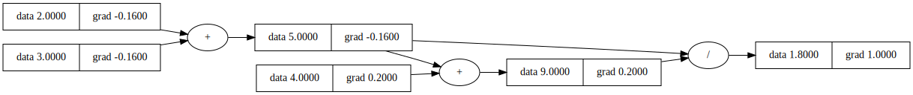

# Neural-Explorations
Neural Experiments is a place where I do some experiments on different deep neural networks!!!

## Micrograd

This repository contains my implementation of Micrograd, inspired by Andrej Karpathy’s [Micrograd](https://github.com/karpathy/micrograd) series. I have extended the original implementation by adding several new features and enhancements.

Currently adding support for scalar values and building MLP using those scalar values.

Tracking gradient using Micrograd engine.

```python
import Value from engine
from utils import draw_graph
a = Value(2.0)
b = Value(3.0)

c = a + b
d = c + 4
e = d / c

e.backward()

draw_graph(e)
```



### Creating a MLP using Values and micrograd engine for backpropagation

```python
from nn import MLP, mse_loss
from nn import Optimizer

layers = [2, 1]
inputs = [2.0, 3.0]
targets = [1.0]

# model initialization
my_model = MLP(layers)

optimizer = Optimizer(my_model.parameters(), lr=0.01)

# forward pass
output = my_model(inputs)
print(f'model_output: {output}')

optimizer.zero_grad()
loss = mse_loss(output, targets)
print(f'model_loss: {loss.data}')

# backward pass of loss
loss.backward()

my_model.print_grad()
```

### Comparing the model output/loss and gradient with pytorch implementation

This can be done using the following way:

```python
from utils import PytorchModel
import torch

# pass in the model created using micrograd MLP
pytorch_model = PytorchModel(my_model)
output = pytorch_model(torch.tensor(inputs))
print(f'pytorch_model_output: {output}')

targets_tensor = [t for t in targets]

loss = sum([ (p - t) ** 2 for p, t in zip(output, targets_tensor)]) / len(output)

print(f'pytorch_loss: {loss.item()}')

loss.backward()

print("Pytorch gradients:")
for i, layer in enumerate(pytorch_model.layers):
    print(f"Layer {i}:")
    for neuron in layer.linear:
        print("Neuron:")
        for w in neuron.weights:
            print(w.grad)
        print(neuron.bias.grad)
```

